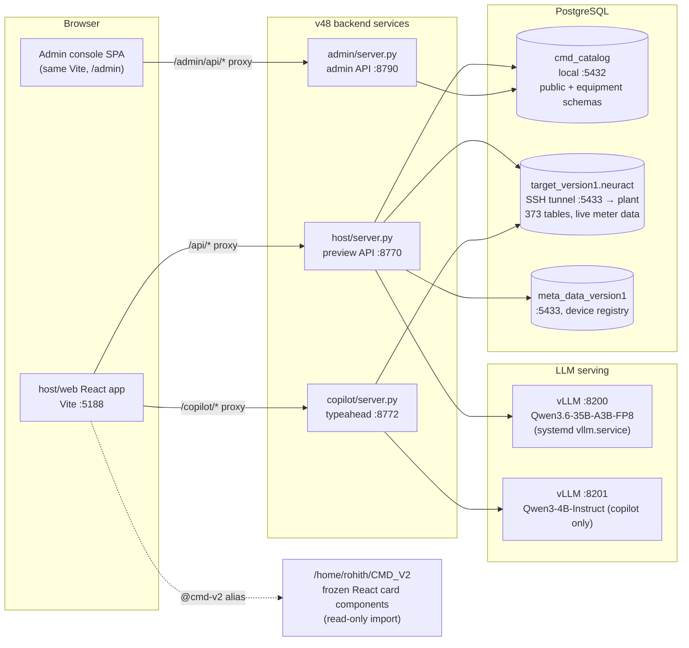
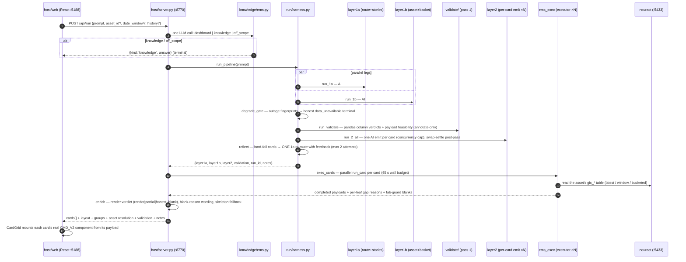
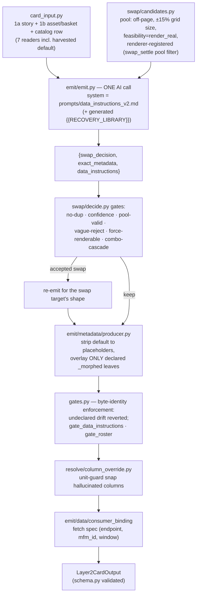
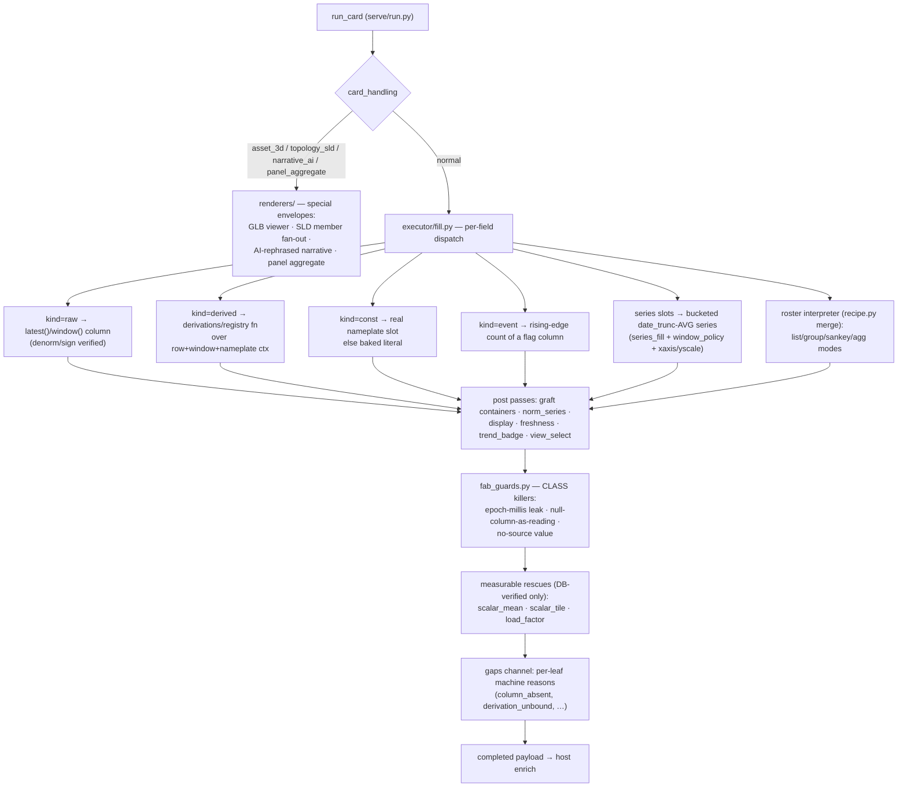
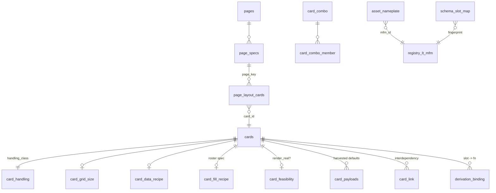
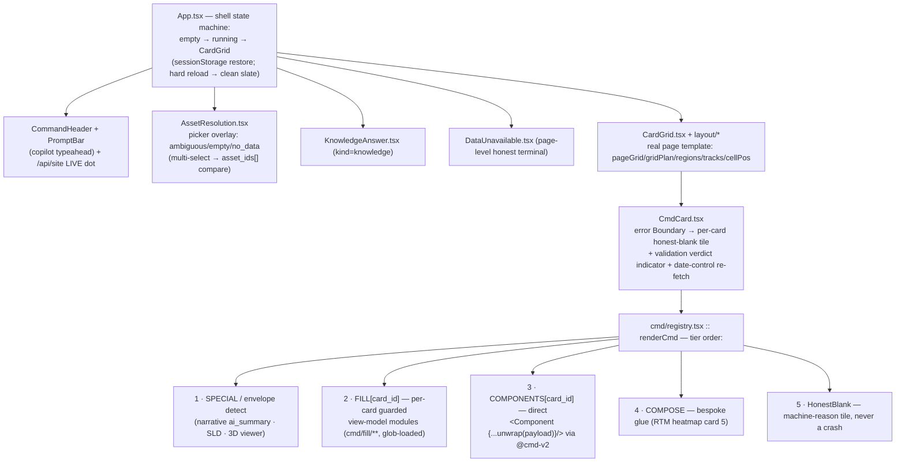

# pipeline_v48 — Architecture

*Onboarding-grade architecture documentation. Surveyed directly from the code and live databases on 2026-07-12.
Complements `README.md` (one-page wiring) and `docs/V48_FULL_WALKTHROUGH_2026-07-02.md` (a point-in-time deep audit —
note that several things have changed since it was written; this document reflects the current state).*

---

## Table of contents

1. [What this system is](#1-what-this-system-is)
2. [Design principles — why the system looks like this](#2-design-principles)
3. [System context and services](#3-system-context-and-services)
4. [Repository layout](#4-repository-layout)
5. [End-to-end request flow](#5-end-to-end-request-flow)
6. [The AI pipeline (layer1a ∥ layer1b → layer2)](#6-the-ai-pipeline)
7. [The executor pipeline (ems_exec)](#7-the-executor-pipeline)
8. [The validation pipeline](#8-the-validation-pipeline)
9. [Data access and repositories](#9-data-access-and-repositories)
10. [Database schema](#10-database-schema)
11. [API endpoints](#11-api-endpoints)
12. [React architecture (host/web)](#12-react-architecture)
13. [Configuration system](#13-configuration-system)
14. [Observability, replay, and profiling](#14-observability-replay-and-profiling)
15. [Sidecar services: copilot and knowledge](#15-sidecar-services)
16. [Retired subsystems and history](#16-retired-subsystems-and-history)
17. [Glossary](#17-glossary)
18. [Onboarding: how to run, test, and debug](#18-onboarding)

---

## 1. What this system is

pipeline_v48 turns a **natural-language EMS prompt** ("show me energy consumption of DG-1 today") into a **page of
real CMD_V2 React dashboard cards filled with live electrical-meter data**, under a strict **render-guarantee
contract**: every card either renders real values read from the plant's live database, or *honest-blanks* with a
machine-readable reason — never a fabricated number, never mock data presented as live, never a crash.

The work is split into two very different halves:

- **AI decides** (three pure-LLM layers against a local vLLM): which page template answers the prompt, which physical
  asset (meter) the user means, which real database columns can serve it, and — per card — whether to keep or swap the
  card, which metadata labels to morph, and a *data recipe* declaring how each data slot should be filled.
- **Deterministic code executes**: a per-card executor reads the resolved meter's time-series table directly and
  completes the card's payload leaf-by-leaf from the AI-authored recipe, followed by fabrication guards, render
  verdicts, and a React frontend that mounts each card as its real CMD_V2 component via `<Component {...payload}/>`.

The AI never touches a number that ships to the screen; the deterministic code never makes a semantic decision. That
split is the central idea of v48 and the reason most of the folder structure exists.

**EMS** is the production Energy Management System product; **CMD_V2** (`/home/rohith/CMD_V2`, a separate read-only
repo) is its React command-center frontend, whose ~46 card components v48 imports and renders *unmodified*. v48 is,
in effect, an AI compiler from "a sentence" to "a CMD_V2 page wired to live data".

---

## 2. Design principles

These principles are enforced by code and tests, not just convention. Understanding them explains almost every
otherwise-surprising structure in the repo.

### 2.1 Render guarantee: real, or honest-blank with a reason — never fabricated
Every leaf of every card must be traceable to a real database value, or be blanked (`None` / `"—"`) with a
machine-readable reason (`cmd_catalog.reason_template` rows: `column_absent`, `structurally_null`,
`derivation_unbound`, `no_nameplate`, `denorm_garbage`, …). Fabrication is treated as a *class* of bug and killed by
class-level guards (`ems_exec/executor/fab_guards.py`), not per-card patches. A whole-DB outage is just the extreme
case of "no data" and gets the same honest treatment (`run/degrade_gate.py`).

### 2.2 AI authors → deterministic code runs → deterministic code verifies
Each AI layer emits a *spec* (a route, an asset pin, a column basket, a per-card recipe). Deterministic code executes
the spec and *gates* it: byte-identity gates revert undeclared metadata drift, column overrides snap hallucinated
columns to real ones, swap-settle removes duplicate swap targets, fabrication guards blank impossible values. The
worst AI failure mode is designed to equal the deterministic default (e.g. `ems_exec/executor/recipe.py`: no AI
emission → the recipe row ships verbatim).

### 2.3 Per-LEAF degradation, never per-card
A card always renders its *own* real CMD_V2 component; only the leaves that lack data blank. When Layer 2 is skipped
entirely, the host serves the card's harvested *skeleton* (`card_payloads.payload_stripped` — the Storybook default
with every data leaf nulled to a typed placeholder) so structure and chrome survive (`host/payload_store.py`). Render
verdicts (`render | partial | honest_blank`) are **telemetry, not render gates**.

### 2.4 Atomic structure: one single-purpose file per concern
Every layer is a folder of small single-purpose modules (`layer1b/resolve/confident_pin.py`,
`ems_exec/executor/yscale.py`, …). Facades re-export byte-compatibly so importers never break when a concern is
extracted. Prompts are separate `.md` files; policies are separate DB rows. There are no monoliths on purpose.

### 2.5 DB-driven configuration with code-default fallback
Every threshold, timeout, vocabulary, feature flag, and human-readable reason sentence is an editable row in
`cmd_catalog` (mostly `app_config`, 316 rows) read through a `config/*` accessor that falls back to a code default and
**never caches a failed load** (see §13). Behavior changes are DB edits, not deploys.

### 2.6 Fail-open observation, fail-loud data
Observability, replay capture, and caches must never break a request (`try/except` + fail-open everywhere in `obs/`,
`replay/`, `data/ttl_cache.py`). Data reads are the opposite: `data/db_client.q` **raises** on a psql error rather
than returning `[]`, because a silent empty result masquerades as "no data" and lies to the user.

### 2.7 Never-cache-empty + TTL (the cache-poison lesson)
Long-running servers ride a flaky SSH tunnel to the plant DB. A single tunnel flap used to poison a process-lifetime
dict cache with an empty result (blank panels until manual restart). The fix is structural: resolution caches are
`data/ttl_cache.TTLCache` (DB knob `cache.resolution_ttl_s`, default 120 s) and empty/failed loads are never cached
(`config/app_config.py`, `ems_exec/data/neuract.py`, `data/lt_panels/panel_members.py`).

---

## 3. System context and services



| Service | Port | Code | Purpose |
|---|---|---|---|
| Host preview API | **:8770** (`V48_HOST_PORT`) | `host/server.py` (stdlib `ThreadingHTTPServer`) | Runs the pipeline per prompt, completes payloads, serves cards to the FE |
| Frontend dev server | **:5188** | `host/web` (Vite + React 19) | Renders the cards; proxies `/api`, `/copilot`, `/admin/api` |
| Admin console API | **:8790** (`V48_ADMIN_PORT`) | `admin/server.py` | Run browser, traces, AI usage, failures, replay launcher |
| Copilot | **:8772** (`COPILOT_PORT`) | `copilot/server.py` | Prompt-bar typeahead; fully decoupled from the pipeline |
| Pipeline LLM | **:8200** | vLLM, `Qwen/Qwen3.6-35B-A3B-FP8` (temp 0, JSON mode) | All 5 pipeline AI calls + knowledge answers |
| Copilot LLM | **:8201** | vLLM, `Qwen/Qwen3-4B-Instruct-2507-FP8` | Copilot suggestion generation only |
| Catalog DB | **:5432** | Postgres `cmd_catalog` | The "brain": card/page catalog, defaults, config, obs |
| Live data DB | **:5433** | SSH tunnel (`ops/db-tunnel.service`) → plant Postgres | `target_version1` schema `neuract` (live meters) + `meta_data_version1` (device registry) |

---

## 4. Repository layout

Root: `/home/rohith/desktop/BFI/backend/layer2/pipeline_v48` (432 Python files; the React app lives in `host/web`).

```
pipeline_v48/
├── run/            Orchestrator: harness (entrypoint), 1a∥1b parallel join, per-card L2 fan-out,
│                   reflect (one re-route), degrade gate, run ids, granularity reconcile.
├── layer1a/        AI page router + per-card story writer. db_reads/ (catalog queries),
│                   parse/ (deterministic clamps/gates on the AI answer), partition_inputs/
│                   (edge sources for group detection), prompts/ (*.md system prompts).
├── layer1b/        AI asset resolver + column basket. resolve/ (candidates, confident pin,
│                   ambiguity, has_data, member scope), basket/ (real-column basket + AI pick),
│                   guardrail/ (retry, same-family gate, spelling recovery), compare/ (multi-asset
│                   "compare A and B" detection), prompts/.
├── layer2/         AI per-card morph-emit. catalog/ (7 single-purpose cmd_catalog readers),
│                   emit/ (the ONE per-card LLM call + metadata producer + morph map + consumer
│                   binding), swap/ (candidate pool + decision gates), gates.py (byte-identity),
│                   resolve/ (column override), schema.py (output contract), prompts/.
├── partition/      Union-find interdependency-group detection over 4 edge sources.
├── grounding/      Deterministic grounding transforms: harvested-default assembly (skeletons),
│                   schema fingerprint/route (slot→column per table shape), swap settle post-pass.
├── ems_exec/       THE EXECUTOR. data/ (the only door to live gic_* tables), executor/ (per-field
│                   fill + ~30 atomic passes + fab_guards + roster interpreter), derivations/
│                   (pure derived-metric fn library), renderers/ (special cards: panel_aggregate,
│                   asset_3d, topology SLD, narrative), serve/ (run_card facade).
├── validate/       Pass-1 validation (pre-Layer-2, pandas): per-column data verdicts, payload
│                   supply-vs-demand, topology feasibility; post-fill render verdict.
├── validation/     The WALL harness: prompt corpus generator + parallel /api/run runner +
│                   determinism/datesync/expectation checks + HTML/JSON reports.
├── host/           Serve boundary: server.py (:8770 HTTP), exec_cards (parallel executor fan-out),
│                   assemble (per-asset card assembly), enrich (FE card build + reasons), multi_asset
│                   (compare lanes), payload_store (skeleton/default caches), web/ (React app).
├── admin/          Admin console API (:8790) over outputs/ logs + obs tables + replay.
├── copilot/        Standalone prompt-typeahead service (:8772 + its own 4B model on :8201).
├── knowledge/      The one-call knowledge layer: route+answer+refuse conceptual questions.
├── data/           Cross-cutting DB clients: db_client.q (psql, fail-loud), ttl_cache,
│                   equipment/ (cmd_catalog.equipment bridge), lt_panels/ (panel members),
│                   registry/ (lt_mfm reader).
├── registries/     neuract/ registry readers: meters (lt_mfm), members, topology, nameplate, 3D.
├── config/         ~30 single-purpose DB-driven config accessors (see §13). databases.py is the
│                   single home of DB wiring; app_config.py is the cfg() accessor.
├── llm/            client.py — the ONE Qwen call convention (classify failures, stage timeouts,
│                   bounded retries, truncation fail-fast); config.py (URL/model).
├── obs/            Tracing/spans/stages, ai_log (urllib monkeypatch), failures, notes, sinks
│                   (console/jsonl/pg), redact, query helpers.
├── replay/         Full-fidelity per-request capture (LLM + SQL, full rows) + deterministic
│                   re-execution + side-by-side diff. Hooks live in data/db_client and llm/client.
├── profiler/       Log-mining performance/latency/AI-usage reports (HTML + CLI).
├── db/             SQL seeds/fixes/patches for cmd_catalog (applied via psql, append-only style).
├── payload_db/     Storybook payload harvest tooling (harvest_*.mjs against CMD_V2 Storybook).
├── scripts/        Operational one-offs: stripped-payload builds, registry sync, wf_*.js
│                   (multi-agent workflow scripts used during certification sweeps).
├── tools/          Developer tools: payload_diff (deep payload comparison), asset_sweep,
│                   morphmap A/B, seed_quantity_vocab, tunnel_monitor, wall corpus replay.
├── tests/          91 pytest files (unit + wired + live-DB acceptance; see §8.5).
├── docs/           Design specs (V48_BUILD_SPEC*.md, V48_DESIGN_NOTES.md), FE contract
│                   (docs/fe_contract/), audits, findings, open items.
├── outputs/        Run artifacts: logs/ (ai_*.jsonl, pipeline_*.jsonl), traces/ (replay bundles),
│                   notes/, validation/, batch/, cert_*/ sweeps, host.log.
├── ops/            db-tunnel.service (systemd unit for the :5433 SSH tunnel).
├── archive/        Retired subsystems (layer3, workers, legacy-EMS) — do not reuse.
└── services/       tiny shared helpers (dict_merge).
```

Empty/vestigial: `contracts/` (JSON schemas moved into per-layer `schema.py` + docs), `ems_compat/` (superseded —
v48 reads neuract directly), `outputs/backups`, `err.log`.

---

## 5. End-to-end request flow



Two user-visible detours:

- **Ambiguous / empty asset** — 1b returns candidates instead of a pin; the FE overlays the `AssetResolution` picker;
  the pick re-enters `POST /api/run` with `asset_id` (1b then skips its AI call via `resolve/pinned_skip.py`).
- **Multi-asset compare** — the picker (or a "compare A and B" prompt via `layer1b/compare/`) sends `asset_ids[]`;
  `host/multi_asset.py` routes 1a **once**, Layer 2 authors **once per asset class**, then each asset lane rebinds
  the class recipe (`host/rebind_consumer.py`) and fills from its own table (`host/assemble.py`). The single-asset
  path is byte-untouched when N==1.

Interactive date navigation re-fills a single card through `POST /api/frame` using the *same* executor (§11).

---

## 6. The AI pipeline

Everything below runs inside `run/harness.py::run_pipeline` — the single backend entrypoint (also exercised directly
by tests and batch scripts). All LLM traffic goes through `llm/client.py::call_qwen` (temp 0, pinned seed, JSON mode,
per-stage DB-driven timeouts, classified failures) against vLLM :8200.

**The complete AI-decision inventory** (everything else in the repo is deterministic):

| # | Call site | Decides | Cardinality |
|---|---|---|---|
| 1 | `layer1a/route.py` | the ONE page template (`page_key`) + metric + intent + time window | 1× (+1 on re-route) |
| 2 | `layer1a/story_builder.py` | one `analytical_story` sentence per card on the page | 1× |
| 3 | `layer1b/resolve/asset_resolve.py` | confident asset pin vs ambiguous candidates vs empty | 1× (skipped on pin) |
| 4 | `layer1b/basket/column_basket.py` | feasible/probable real columns for that asset | 1× |
| 5 | `layer2/emit/emit.py` | per card: keep/swap + metadata morphs + the full data recipe | N× (2× on accepted swap) |
| 6 | `ems_exec/renderers/_insight.py` | *nothing semantic* — rephrases a pre-computed narrative sentence | narrative cards only |
| — | `knowledge/ems.py` | route+answer+refuse conceptual questions (pre-pipeline gate) | 1× per request |

### 6.1 run/ — the orchestrator

*Why it exists:* something has to own the 1a∥1b join, the honest-terminal policy, and the single re-route loop —
without becoming a monolith. `run/` is that thin spine; each concern is one file.

- `harness.py` — `run_pipeline(prompt, *, asset_id=None, …)`. Fires 1a ∥ 1b (`run/parallel.py`, a ThreadPoolExecutor
  wrapper that copies `contextvars` so obs spans follow threads and returns exceptions as values), applies the degrade
  gate, runs validation pass 1, gates Layer 2 on a pinned asset (`how ∈ {AI, user-choice}`), fans out Layer 2, and
  runs the **reflect loop**: a HARD Layer-2 failure (exception / timeout / non-conforming emit) triggers ONE 1a
  re-route with feedback (`_MAX_ATTEMPTS = 2`); an *honest answerability gap* is a valid terminal and is not re-routed
  (DB knob `reflect.reroute_on`). Also exports `run_pipeline_multi` (route once, one L2 authoring per asset class).
- `layer2_all.py` — the per-card fan-out. Cards emit concurrently (vLLM batches), capped by
  `layer2.emit_concurrency` (default 4) so N ~22K-token emits don't split vLLM throughput past the `l2_emit`
  timeout. After all emits, `grounding/swap_settle.settle` deterministically resolves swap collisions.
- `degrade_gate.py` — the ONE place a layer exception is classified as an **infrastructure outage** (editable
  fingerprint list: "connection refused", "timed out", …) and turned into the honest `data_unavailable` page terminal
  with a `reason_template` sentence. Logic errors are deliberately NOT matched — they surface as real errors.
- `reflect.py` — builds the re-route feedback (failed card titles + what the asset actually measures) and the
  loop1/loop2 NOTES persisted via `obs/notes.py`.
- `run_id.py` — deterministic `r_<sha1(prompt)[:10]>` run id (log correlation across ai/pipeline logs).

### 6.2 layer1a — the storytelling page router

*Why it exists:* the product has a fixed set of designed pages (page templates with card layouts). Rather than
composing dashboards card-by-card (fragile, unbounded), v48 routes every prompt to the best existing page and then
adapts that page. 1a is the router plus the narrative that tells every later layer *why* this page answers the prompt.

- `route.py` — **AI #1** over `cmd_catalog.page_specs` (compressed by `catalog_compress.py`), restricted to
  `config/available_pages.py` (env > `routable_pages` table > default) and pre-filtered by
  `parse/template_feasibility_gate.py` (drop templates whose cards mostly can't render). **Fail-closed**: an LLM
  outage raises with an outage fingerprint (→ honest terminal) instead of silently routing to an arbitrary page.
- `story_builder.py` — **AI #2**: one `analytical_story` per card (the per-card intent Layer 2 morphs toward).
- `db_reads/` — the catalog queries: `page_specs`, `card_titles`, `cards_intent` (the wide join of
  `page_layout_cards ⋈ cards ⋈ card_grid_size ⋈ card_data_recipe ⋈ card_handling`), `page_layout` (the grid
  template), `page_feasibility`.
- `parse/` — deterministic clamps on the AI answer: metric/intent vocabulary clamps, window defaults, page-key
  recovery, granularity reconciliation.
- `partition_inputs/` + `partition/` — group detection: union-find over 4 edge sources (`card_link`,
  `card_combo_member`, `page_control`, `cards.interdependency` prose) → `interdependency_groups`, which the FE uses
  for cross-card date sync and the emit prompt uses to flag group cards.

Output contract: `layer1a/schema.py::Layer1aOutput` — `{page_key, metric, intent, window, cards[], layout, groups}`.

### 6.3 layer1b — the asset resolver + column basket

*Why it exists:* prompts name assets loosely ("transformer 1", "AHU-5", a misspelling). The pipeline needs exactly one
physical meter (a `neuract.gic_*` table) or an honest "which one?" question — and, before any card is authored, an
honest inventory of which *real columns* that meter logs. 1b produces both, card-agnostically.

- `resolve/` — builds the candidate universe from the `meta_data_version1` device registry
  (`app_devices ⋈ app_device_tables ⋈ app_gateways`), tags value-aware `has_data` (latest row must have ≥3 non-null
  metric columns) and `has_feeders`; **AI #3** resolves by verbatim name (ids hidden from the model). Outcomes
  (`how`): `AI` (confident pin) / `user-choice` (picker pin) / `ambiguous` (candidate list → FE picker) / `empty` /
  `no_data` (honest notice). `member_scope.py` resolves panel prompts to incomer vs outgoing member sets.
- `basket/` — reads the pinned table's real columns from `information_schema` (`col_dict.py`; BFS to a representative
  feeder table for aggregate panels that don't log directly), then **AI #4** picks a generous `feasible` +
  ranked `probable` column basket (with confidence and `substitute_for`), hard-filtered to columns that physically
  exist — the no-hallucination floor for everything downstream. `topology_siblings.py` attaches member tables for
  panels.
- `guardrail/` — one bounded retry, a same-family gate (a UPS prompt can't pin a transformer), spelling recovery.
- `compare/` — detects natural-language multi-asset compares and resolves the named assets to ids (feeds
  `host/multi_asset.py`).

Output contract: `layer1b/schema.py::Layer1bOutput` — `{asset{name,mfm_id,table,class}, how, candidate_list,
column_basket, member_scope, contract_problems}`.

### 6.4 layer2 — the per-card morph-emit (the heart of the AI pipeline)

*Why it exists:* every card on a routed page was designed against a Storybook demo payload. Layer 2's job is to turn
that frozen default into *this user's* card: retitle/relabel it for the pinned asset (metadata morphs), swap it for a
better card when the page's card can't serve the story, and — critically — author the **data recipe** that tells the
executor how to fill every data slot from real columns. It runs once per card, in parallel.



Key mechanics:

- **One system prompt**: `layer2/prompts/data_instructions_v2.md` (the older swap/metadata/data trio was consolidated
  2026-07-08; `emit.py` is always-v2). The `{{RECOVERY_LIBRARY}}` placeholder is *generated from the live derivation
  registry* (`ems_exec.derivations.registry.catalog()`) so the AI-visible function list can never drift from code.
- **Byte-identity**: `exact_metadata` starts as the card's harvested default stripped to typed placeholders
  (`grounding/default_assemble.py`); the AI may only change leaves it *declares* in `_morphed`; `gates.py` reverts
  anything else. This is what makes "0 fabrication" auditable — every byte is either the verified default or a
  declared, gated morph.
- **`data_instructions`**: per-slot field declarations `{slot, kind: raw|derived|const|text|event, column|fn,
  window, …}` plus an optional `roster` block for list-shaped cards (merged against the authoritative
  `card_fill_recipe` row by `ems_exec/executor/recipe.py`).
- **Emit hardening** (`emit.py`, `llm/client.py`): stage-tagged timeout (`llm.timeout.l2_emit`), one bounded transport
  retry, **no retry on deterministic failures** (`llm.no_retry_kinds` = timeout, truncated — a pinned-seed truncation
  reproduces and retrying only doubles the hang), gate-failure feedback re-prompt, `{"_llm_error": kind}` markers so
  transport failure is distinguishable from an honest empty emission.
- **Swap settle** (`grounding/swap_settle.py`): parallel emits run with an empty `already_chosen`, so two slots can
  independently swap to the same target; the settle pass replays swaps deterministically (highest confidence first)
  and reverts losers to keep. It also pre-filters the pool to targets with a recoverable default AND a registered FE
  renderer — a swap can never point at a card that would white-screen.

---

## 7. The executor pipeline

*Why it exists:* the render guarantee demands that numbers on screen come from the database via auditable,
deterministic code. `ems_exec` is that code: a self-contained per-card executor that takes Layer 2's
`{exact_metadata, data_instructions}` and returns the **completed CMD_V2 payload** — real where neuract has data,
honest-blank everywhere else. It replaced two earlier designs (the workers/ WebSocket data-fill and the Layer-3 AI
payload cleaner, both retired 2026-07-02) because both put too much machinery — or an AI — between the database and
the screen.

Entry: `ems_exec/serve/run.py::run_card(exact_metadata, data_instructions, asset_table, db_link, window, …)` — a plain
function, called per card in parallel by `host/exec_cards.py` under one wall-clock budget
(`ems_exec.card_budget_s`, default 45 s: one slow card degrades honestly instead of sinking the page).



Key properties:

- **`executor/fill.py`** is the facade: per-field dispatch plus pass order; every other concern is an atomic sibling
  (`paths`, `verify` for denorm/sign, `series_fill`, `wildcards`, `indexed_families`, `graft` for restoring
  gate-elided containers from the harvested default, `window_policy`, `xaxis`/`yscale`, `epoch`, `freshness`,
  `members`, the `roster_*` family, …). Writes are **type-preserving** (a scalar None never nulls an array leaf) and
  the executor **never raises** — any failure honest-blanks with a reason.
- **`derivations/`** — a pure-function library (power, energy, current, voltage, power-quality, breaker, nameplate,
  topology, generic expressions) with a registry; bound to slots via `cmd_catalog.derivation_binding` rows. The AI
  picks *which* function; the function computes.
- **`renderers/`** — the four special handling classes whose payloads are widget envelopes, not flat props:
  `panel_aggregate.py` (fans a panel out to its member meters via `registries/neuract/members.py` +
  `data/lt_panels/panel_members.py` and rolls the electrical up, reusing `fill.py` via the `_agg_row` hook — wired
  live 2026-07-08 with the equipment-schema work), `asset_3d.py` (GLB viewer envelope), the topology SLD, and
  `narrative_ai.py` (`_story/` computes page-specific facts in Python; `_insight.py` only rephrases — AI decides
  nothing). `serve/run.py` also runs the last-word sankey sweep: a null-endpoint link never ships (d3-sankey crash).
- **`fab_guards.py`** — deterministic post-fill **fabrication-class killers**, slot-name-independent (see §2.1). They
  run after all honest fills, so they can never fight one; the three measurable *rescues* that follow only add
  DB-verified values to now-blank leaves.
- **The gaps channel** — every blanked leaf gets a machine-readable reason record (`gaps.py` `GAPS_KEY`), popped at
  the serve boundary into `render.reason`/`render.gaps` by `host/enrich.py`, which words them into one honest,
  deduplicated sentence per card. Telemetry only; never a render gate.

At the host boundary, `host/enrich.py` folds executor output + Layer-2 output + the post-fill verdict
(`validate/render_verdict.py`) into the one FE card dict: completed payload, `render_card_id` (follows swaps),
verdict `render | partial | honest_blank`, reason, `watermark: 'live'`, plus a `refetch` bundle for per-card date
navigation. When Layer 2 was skipped, `host/payload_store.py` serves the card's harvested skeleton instead (§2.3).

---

## 8. The validation pipeline

Validation is layered — five distinct nets, each catching a different failure class, none blocking a render except
the honest terminals:

### 8.1 Pass 1 — pre-Layer-2 (`validate/`)
`validate/build.py::run_validate` runs after 1a∥1b, before any emit. Pure pandas, no AI: probes the newest ~500 rows
of the basket's table and grades every basket column pass/warn/fail (`data_validate.py`); checks payload
supply-vs-demand over the harvested defaults (`payload_validate.py`); computes topology feasibility
(`expected_gap_frac` — an infeasible page re-routes *before* paying for N emits). The result is a machine verdict
Layer 2 consumes: failed columns become unbindable in the emit gates. Policy is annotate-only (`FAILURE_POLICY`); the
"chilled" gate blocks Layer 2 only when the basket had columns and zero passed.

### 8.2 Pass 2 — in/post-emit (`layer2/gates.py`, `grounding/swap_settle.py`)
Emission conformance: byte-identity enforcement on `exact_metadata`, structural gates on `data_instructions` and
rosters, column unit-guards, swap gates, deterministic swap settle. A gate failure triggers one feedback re-prompt;
persistent failure degrades honestly (skeleton payload + reason).

### 8.3 Fill-time and post-fill (`ems_exec`)
Denorm/sign verification on every raw read (`executor/verify.py`), fabrication-class guards (`fab_guards.py`), the
per-leaf gaps channel, and the deterministic render verdict (`validate/render_verdict.py`) — `render` (all declared
leaves real) / `partial` / `honest_blank`. Note the certified rule: *the verdict is telemetry* — a `render` verdict
is NOT proof of data (a card can render entirely from chrome); real-vs-empty audits diff the filled payload against
the seed instead (see `docs/` audit notes).

### 8.4 Page-level honest terminals
`run/degrade_gate.py` (infra outage → `data_unavailable` + reason sentence) and the 1b asset gate
(`no_data` / `ambiguous` / `empty` → notice or picker, Layer 2 skipped).

### 8.5 Offline walls — `tests/`, `validation/`, FE gates, `replay/`
- **`tests/`** — 91 pytest files spanning unit gates, wired seams, and live-DB acceptance (`test_fab_guards.py`,
  `test_family_h_render_safety.py`, `test_layer1a_routing.py`, `test_ems_exec_roster.py`, …). The certified suite
  stood at ~880 green tests at the 2026-07-08 equipment-wiring cert. Many tests hit the live catalog DB; run with
  services up.
- **`validation/`** (the *wall harness*, distinct from `validate/`) — generates a prompt corpus
  (`corpus/universe|templates|generate|mutate`), runs it against `/api/run` in parallel with auto-throttle (vLLM
  contention manufactures fake timeouts above ~3 concurrent runs — the runner halves its lane instead of reporting
  lies), applies checks (determinism, datesync, expectations), and emits HTML/JSON reports. Every case leaves a
  replayable artifact under `sessions/`.
- **FE render gates** — `host/web` npm scripts: `ssr-gate` (server-render every card payload; a crashing
  honest-blank leaf is a build failure), `client-gate`, `layout-gate`.
- **`replay/`** — every `/api/run`+`/api/frame` writes a full-fidelity trace bundle (§14); the engine re-executes a
  trace deterministically and diffs, which is how regressions are localized without live traffic.

---

## 9. Data access and repositories

*Why this layer exists:* three databases, two of them behind a flaky tunnel, and a render guarantee that forbids both
fabrication and silent emptiness. All access is therefore funneled through a handful of single-purpose "doors", each
with an explicit honesty contract:

| Door | File | Contract |
|---|---|---|
| Catalog/registry SQL | `data/db_client.py::q(db, sql)` | psql subprocess, CSV; **raises** on error (never a silent `[]`); replay-hooked |
| Live time-series | `ems_exec/data/neuract.py` | THE only door to `gic_*` tables. Pooled psycopg2; introspects columns and pads missing → None (never a SQL crash); latest/window/bucketed reads ordered by `timestamp_utc::timestamptz`; TTL + never-cache-empty schema caches |
| Meter registry | `registries/neuract/` (`meters`, `members`, `topology`, `nameplate`, `assets3d`) | `lt_mfm` (320 rows) is the join key of everything; membership comes from `lt_mfm_incoming/outgoing` edges (NOT `panel_id`, which is empty — a documented ground-truth gotcha) |
| Panel membership | `data/lt_panels/panel_members.py` | TTL-cached, never-cache-empty (the 2026-07-09 poison fix) |
| Equipment KB | `data/equipment/` (`bridge`, `db`, `ratings`, `edges`, `kitpreview`) | Bridges `cmd_catalog.equipment` (22 tables) to canonical meters by `table_name` only (id spaces differ!); per-row identity gate stops a bay meter claiming its host panel's identity; all fns fail-open None/[]/{} |
| Device universe | `layer1b/resolve/asset_candidates.py` | `meta_data_version1.app_devices ⋈ app_device_tables ⋈ app_gateways` |
| Config | `config/*` accessors | DB row → cast → code default; never-cache-empty (§13) |

**Models / contracts.** v48 has no ORM. The "models" are (a) the per-layer output contracts —
`layer1a/schema.py::Layer1aOutput`, `layer1b/schema.py::Layer1bOutput`, `layer2/schema.py::Layer2CardOutput` — each a
validated dict shape with a `build_*`/`validate_*` pair; (b) the CMD_V2 **payload shapes** harvested into
`cmd_catalog.card_payloads` (the byte-identity reference); and (c) the FE mirror `host/web/src/types.ts`
(`PipelineResult`, `Card`, `DateWindow`). The FE-owned interactivity contract is documented (markdown only) in
`docs/fe_contract/`.

---

## 10. Database schema

Three live databases; all wiring in `config/databases.py` (PG_* env overrides).

### 10.1 `cmd_catalog` (local :5432) — the brain

61 tables in `public` + 22 in the `equipment` schema. Grouped by concern:



| Group | Tables | Purpose / who reads it |
|---|---|---|
| Routing & pages | `pages`, `page_specs` (75), `routable_pages`, `page_layout_cards`, `page_control`, `prompt_category`, `prompt_template`, `prompt_vocab` | layer1a routing + layout; the FE grid template |
| Cards & handling | `cards` (145), `card_handling` (145: handling_class = single-asset / panel_aggregate / asset_3d / topology_sld / narrative_ai / nav), `card_grid_size`, `card_data_recipe`, `card_fill_recipe` (roster specs), `card_feasibility`, `card_controls`, `card_link`, `card_combo` + `card_combo_member` | layer2 catalog readers; executor recipe merge; partition edges |
| Ground-truth payloads | `card_payloads` (155 — the harvested byte-faithful Storybook defaults + `payload_stripped` skeletons), `card_component_usage`, `payload_shapes`, `card_render_map`, `card_rendering`, `components`, `contract_components`, `contract_capabilities`, `card_contract_binding` | grounding/default_assemble; L2 byte-identity; host/payload_store |
| Config-as-data | `app_config` (316 rows — every knob), `reason_template`, `schema_slot_map`, `metric_class`, `derivation_binding`, `data_quality_policy`, `event_threshold`, `endpoint_policy`, `endpoint_recipe_map`, `live_window_policy`, `band_policy`, `limit_override`, `nameplate_config`, `viewer_policy`, `render_guarantee_matrix` + `render_guarantee_page_phrase`, `asset_class_default`, `pcc_panel_alias` | the `config/*` accessors (§13) |
| Asset registry mirror | `registry_lt_mfm(_incoming/_outgoing/_type)`, `registry_asset(_type)`, `registry_device_mappings`, `registry_sync_meta`, `asset_nameplate` (320: real ratings or honest NULL), `asset_3d_registry` | synced from neuract by `scripts/sync_neuract_registry.py`; nameplate consts; 3D |
| Observability | `obs_traces`, `obs_stage_events`, `obs_llm_calls`, `obs_db_queries` | obs pg sink; admin console |

**`equipment` schema** (22 tables: `equipment`, `mfm`, `feeder`, `breaker`, `nameplate`, `asset_meter`,
`asset_threshold`, `rtm_threshold`, `bms_meter(_limit)`, `core_assettype`, `core_paneltype`, `data_source`,
`kitpreview_*` …) — the imported equipment knowledge base, bridged fail-open via `data/equipment/` for breaker
ratings, RTM bands, per-asset facts/aliases, and kit-preview 3D presets. Wired 2026-07-08; staged knobs gate which
consumers are on.

`db/*.sql` are the seeds/fixes/patches that populate all of this (append-only style: `seed_*`, `fix_*`, `patch_*`,
`*_schema.sql`) — the closest thing to migrations. `payload_db/harvest_*.mjs` harvested the Storybook defaults.

### 10.2 `target_version1`, schema `neuract` (:5433 tunnel) — the live plant data

373 tables. The ones that matter:

- **`gic_*`** — one table per meter (~70 electrical columns, shared shape). `timestamp_utc` is ISO-8601 **TEXT**
  (hence the `::timestamptz` cast in every read). No `panel_id`, no joins — a card read is "filter this one table by
  time".
- **`lt_mfm`** (320) + **`lt_mfm_incoming` / `lt_mfm_outgoing`** — the meter registry and the topology edges
  (membership truth; `panel_id`/`role` columns are empty — never trust them).
- **`lt_config_field` / `lt_config_value`** — plant-side config used for nameplate defaults.

### 10.3 `meta_data_version1` (:5433) — the device registry
`app_devices` / `app_device_tables` / `app_gateways` → layer1b's 320-device candidate universe (mfm_id contract =
row_number in table order).

---

## 11. API endpoints

### Host preview API — `host/server.py` (:8770)

| Method | Path | Body → Response | Purpose |
|---|---|---|---|
| GET | `/api/health` | → `{ok, sb_base}` | liveness |
| GET | `/api/assets?q=` | → asset candidate list | picker/typeahead over the device registry |
| GET | `/api/site` | → `{ok, site, live}` | header identity (`app_config site.name`) + a REAL probe of the live DB (green dot iff `SELECT 1` on target_version1 answers) |
| POST | `/api/run` | `{prompt, asset_id? \| asset_ids[]?, date_window?, history?}` → `PipelineResult` | the whole pipeline. Flow: knowledge gate → natural-compare pre-flight → single (`build_response`) or multi (`build_response_multi`) → response dump to `outputs/` |
| POST | `/api/frame` | `{exact_metadata, data_instructions, refetch, date_window}` → `{payload}` | per-card date navigation: re-completes ONE card's payload for a new window through the same executor (`handle_frame`), including panel-aggregate fan-out via the `refetch` bundle |

`PipelineResult` carries: `cards[]` (payload + verdict + reason + grid cell + `data_instructions` + `refetch`), page
layout + groups, asset-resolution state (`resolved | ambiguous+candidates | empty | no_data | blocked`), validation
summary, notes (loop1/loop2 explanations), `run_id`, `kind` (`cards | knowledge`), degrade flags.

### Admin console API — `admin/server.py` (:8790)

GET `/admin/api/{health, runs, run/<id>, explorer, coverage, latency, failures, ai-usage, sql, assets-log,
validation, search/prompts, search/errors, replays}` + POST `/admin/api/replay` (launch a deterministic replay of a
prompt). Reads `outputs/` logs and the `obs_*` tables; serves the React admin SPA.

### Copilot — `copilot/server.py` (:8772)

GET `/copilot/health`, GET `/copilot/starters` (suggestion chips), POST `/copilot/suggest` (typeahead completions).
Retrieval over its own sqlite index (`copilot_index.sqlite`) + generation on its own 4B model (:8201). Zero pipeline
coupling by design — it shapes prompts before submission, nothing more.

---

## 12. React architecture

`host/web` — Vite + React 19 + Tailwind; TypeScript. Two apps share the workspace: the command-center shell
(`src/`) and the admin console (`src/admin/`).

**The core render idea: the payload IS the props.** The host returns each card's *completed* CMD_V2 payload, and the
FE mounts the card's real component from it directly — no re-mapping layer, no chart re-implementation. CMD_V2 is
imported read-only through the `@cmd-v2` alias (`vite.config.ts` → `/home/rohith/CMD_V2/src`, React deduped to one
copy, CMD_V2 file-watching ignored so its dev churn can't reload-loop the host).



Points worth knowing:

- **Tier 2 beats tier 3 deliberately** (2026-07-06): a `fill/` module exists precisely because its component needs a
  guarded/finitized view-model or per-card date wiring; letting the generic spread shadow it bypassed those guards.
  `cmd/fill/<page>/card-<id>.tsx` modules export `CARDS: {card_id: (payload) => ReactNode}` and are auto-discovered
  with `import.meta.glob`.
- **Honest-blank on render throw**: CMD_V2 components can throw on a blank leaf (`null.toFixed()`); `CmdCard`'s error
  boundary degrades that card to its own honest-blank tile with the machine reason — per-leaf degradation extended
  into React itself.
- **Date sync**: `DateSyncProvider` + per-card CMD_V2 date controls → `fetchCardFrame` → `POST /api/frame` → the
  card swaps in its re-filled payload; interdependent groups (from partition) move together.
- **Layout**: `layout/` computes the real EMS page grid (regions/tracks/cells) from 1a's page template so a card
  lands in its designed cell; `RtmComposite.tsx` merges the RTM flex pages.
- **Admin SPA** (`src/admin/`): Runs, Trace, AI-usage, Failures, Latency, Coverage, Explorer, SQL, Validation,
  Replay pages over the :8790 API.
- **FE gates**: `npm run ssr-gate` / `client-gate` / `layout-gate` (§8.5).

---

## 13. Configuration system

Three tiers, in precedence order:

1. **Environment variables** — deployment wiring only: `PG_*` (DB endpoints), `V48_LLM_URL`/`V48_LLM_MODEL`,
   `V48_HOST_PORT`/`V48_ADMIN_PORT`/`COPILOT_*`, `V48_EXEC_BUDGET_S`, `V48_ALLOW_ENV_PIN` (gate for the
   `PIPELINE_ASSET_ID` CLI pin — ignored by the long-running host so a launch-time env can't pin every user's asset).
2. **`cmd_catalog` rows** — all behavior: `app_config` (316 rows: `llm.timeout.l2_emit`, `layer2.emit_concurrency`,
   `ems_exec.card_budget_s`, `cache.resolution_ttl_s`, `knowledge.enabled`, `reflect.reroute_on`, `site.name`,
   `chart.*`, `consts.*` thresholds, feature flags …) plus the typed policy tables (`reason_template`,
   `schema_slot_map`, `derivation_binding`, `band_policy`, …).
3. **Code defaults** — every accessor takes a default; the system boots and runs (degraded but honest) with the
   catalog DB down.

The access pattern is uniform: `from config.app_config import cfg; cfg('key', default)` — loads the whole table once
per process **on success only**; a failed load serves code defaults for a 5-second backoff and then self-heals
(never-cache-empty — see §2.7). Around it, `config/` holds ~30 single-purpose accessor modules
(`neuract_dsn`, `available_pages`, `metrics` vocab, `feasibility`, `nameplates`, `schema_map`, `reason_templates`,
`swap`, `windows`, `viewer_policy`, …), each owning one policy read with one code default — the "edit a row, not a
file" contract, with `config/databases.py` as the single home of connection wiring.

---

## 14. Observability, replay, and profiling

*Why it exists:* five AI calls and three databases per request make "what did the model see and why did this leaf
blank?" the daily debugging question. v48 answers it with always-on, fail-open capture at every seam.

- **`obs/`** — `trace.py`/`span.py` (contextvars trace tree that survives thread fan-outs), `stage.py` (per-stage
  line to stderr + `outputs/logs/pipeline_<run_id>.jsonl`), `ai_log.py` (a urllib monkeypatch imported FIRST — every
  vLLM call's full prompt+response → `outputs/logs/ai_<run_id>.jsonl`), `failures.py` (classified failure records),
  `notes.py` (the loop1/loop2 explanations), sinks to console/jsonl/Postgres (`obs_traces`, `obs_stage_events`,
  `obs_llm_calls`, `obs_db_queries`), `redact.py`.
- **`replay/`** — every `/api/run` + `/api/frame` writes `outputs/traces/<trace_id>/`: the exact request, an
  `app_config` + env snapshot, and `events.jsonl` with every LLM call and every SQL read **with full rows**. The
  engine re-executes deterministically from the tape (hooks in `data/db_client.q` and `llm/client`) and diffs —
  identity is the obs `trace_id` (unique per execution), not the prompt-hash `run_id`.
- **`profiler/`** — mines the logs into latency/AI-usage/span reports (CLI + HTML).
- **Admin console** — the human window over all of the above (§11, §12).

Debugging a bad card, in practice: find the run in the admin console (or grep `outputs/logs/pipeline_<run_id>.jsonl`)
→ read the stage line that degraded → open `ai_<run_id>.jsonl` for the exact prompt/response of the guilty AI call →
check the card's `render.gaps` reasons → if needed, `POST /admin/api/replay` and diff.

---

## 15. Sidecar services

- **`knowledge/`** — the one-call knowledge layer (`knowledge/ems.py` + `prompts/ems.md`). Routes every prompt in a
  single LLM call: `dashboard` (defer to the card pipeline, answer empty), `knowledge` (answer the conceptual
  electrical/mechanical question inline), `off_scope` (refuse politely). Fail-open to `dashboard` so the pipeline is
  never blocked; valve `knowledge.enabled`. *Why:* users ask "what is THD?" in the same prompt bar; without this
  gate those prompts would route to an irrelevant dashboard page.
- **`copilot/`** — the EMS Query Copilot (:8772): retrieve-then-generate typeahead over its own sqlite index and its
  own small model (:8201). Deliberately zero pipeline coupling — it can die without affecting `/api/run`. *Why:* the
  prompt bar needs sub-second suggestions; the 35B pipeline model is neither fast nor cheap enough for keystrokes.

---

## 16. Retired subsystems and history

Knowing what was *removed* explains the current shape (and the `archive/` folder):

| Retired | Was | Replaced by | When |
|---|---|---|---|
| **Layer 3** (AI payload verdict/cleaner) | an AI pass over filled payloads | deterministic render verdict + fab_guards + byte-identity gates | 2026-07-02 (`archive/layer3_archive_20260702.tar.gz`) |
| **workers/** WS data-fill | PARSE→FILL→STITCH against legacy-EMS :8890 frames | `ems_exec` direct per-card neuract reads | 2026-07-02 |
| **legacy-EMS / ems_compat** | a copied EMS backend + compat schema | direct `neuract` reads | 2026-06-30 |
| **L2 prompt v1 trio** (`swap/metadata/data_instructions.md`) | 3 composed system prompts | single `data_instructions_v2.md` | 2026-07-08 |
| **name-collision gate** in 1b | deterministic collision veto | pure-AI resolution + guardrails | 2026-07-09 |

Legacy artifacts you will still see: `frames: {}` in responses (FE back-compat), `fill_source='live-frontend'`
labels from the superseded "Option A" era (the fill actually happens server-side in ems_exec), a few stale docstrings
(`emit.py` still says "3 atomic prompt parts"), and orphaned `grounding/` engines whose *policies* live on as
cmd_catalog tables. Relative to **v47** (`../pipeline_v47` — a single-file pipeline with L1–L6 layers and its own
host), v48 is the ground-up atomic rebuild: per-card AI emits against byte-identical defaults, a deterministic
executor, and DB-driven everything. **v49** (Hermes agent) is being planned separately in `../v49/`.

---

## 17. Glossary

| Term | Meaning |
|---|---|
| **card** | one dashboard widget (a CMD_V2 React component + its payload); identified by `card_id` in `cmd_catalog.cards` |
| **page / page_spec** | a designed EMS screen template: a grid of cards with fixed cells (`page_specs`, `page_layout_cards`) |
| **payload** | the JSON prop-object a CMD_V2 component renders; "completed payload" = after the executor filled its data leaves |
| **leaf** | one scalar/array position inside a payload; the unit of degradation |
| **harvested default** | the byte-faithful Storybook demo payload for a card (`card_payloads`) — the shape oracle L2 morphs against |
| **skeleton** | the default with every data leaf nulled to a typed placeholder (`payload_stripped`) — what renders when no data exists |
| **morph** | a Layer-2 metadata edit (title/labels/units) explicitly declared in `_morphed`; anything undeclared is reverted |
| **data_instructions / recipe** | the AI-authored per-slot fill declaration the executor runs (`kind: raw/derived/const/text/event`, roster) |
| **swap** | Layer 2 replacing a page's card with an off-page card that better serves the story (pool-gated, settled deterministically) |
| **basket** | 1b's card-agnostic list of real, feasible columns for the pinned asset |
| **asset / meter / MFM** | one physical measurement point; `lt_mfm` row ↔ one `gic_*` time-series table |
| **panel** | a bus (e.g. PCC-1A) whose electrical picture is the roll-up of member meters (topology edges) |
| **handling class** | how a card is filled/rendered: single-asset, `panel_aggregate`, `asset_3d`, `topology_sld`, `narrative_ai`, nav |
| **honest-blank** | a leaf/card rendered empty with a machine reason instead of a fabricated value |
| **gaps channel** | the per-leaf reason records riding the completed payload (`column_absent`, `no_nameplate`, …) |
| **render verdict** | telemetry per card: `render` / `partial` / `honest_blank` — never a render gate |
| **degrade gate** | the page-level infra-outage classifier → honest `data_unavailable` terminal |
| **reflect** | the one-time 1a re-route with feedback after hard Layer-2 failures |
| **group / interdependency** | cards that must stay in sync (shared date controls); union-find over catalog edges |
| **run_id / trace_id** | `r_<sha1(prompt)[:10]>` (log correlation, collides across executions) vs the unique per-execution replay identity |
| **fab guard** | a slot-name-independent post-fill killer of one fabrication *class* |
| **wall** | a bulk validation sweep of the prompt corpus against `/api/run` (`validation/`) |

---

## 18. Onboarding

### Start the stack (order matters only for the tunnel)
```bash
# 0. Postgres :5432 (cmd_catalog) is local; the plant tunnel is a systemd unit:
systemctl status db-tunnel        # ops/db-tunnel.service → 127.0.0.1:5433
systemctl status vllm             # Qwen3.6-35B on :8200

cd /home/rohith/desktop/BFI/backend/layer2/pipeline_v48
python3 host/server.py            # API :8770  (V48_HOST_PORT)
python3 admin/server.py           # admin :8790 (optional)
python3 copilot/server.py         # copilot :8772 (optional; needs :8201)
cd host/web && npm run dev        # FE :5188
```
Open http://localhost:5188, type a prompt ("energy consumption of DG-1 today"), watch the backend narrate itself in
the host terminal (`obs/stage.py` lines) — that stream is the fastest mental model of the pipeline.

### Run it headless
```bash
python3 -c "from host.server import build_response; import json; \
print(json.dumps(build_response({'prompt':'voltage health of AHU-5'}), default=str)[:2000])"
```

### Tests and gates
```bash
python3 -m pytest tests/ -x -q          # needs cmd_catalog up; live tests also need :5433 + :8200
cd host/web && npm run ssr-gate         # every card payload must server-render
python3 -m sweep.cli …             # the wall harness (corpus sweeps) — keep page-concurrency ≤3
```

### Read next, in this order
1. `README.md` (one page) → this file
2. `docs/V48_FULL_WALKTHROUGH_2026-07-02.md` — the forensic deep-dive (mind its date)
3. `docs/V48_DESIGN_NOTES.md` + `docs/V48_BUILD_SPEC*.md` — the design spine
4. `docs/fe_contract/` — the FE-owned interactivity contract
5. `run/harness.py`, `layer2/build.py`, `ems_exec/executor/fill.py`, `host/server.py`, `host/web/src/cmd/registry.tsx`
   — the five files that, read top-to-bottom (the docstrings are the real documentation), explain 90% of the system

### House rules (enforced by review and tests)
- AI-first: fix behavior in prompts/context first, DB rows second, generic code last; never per-card hardcodes.
- Per-leaf degradation; verdicts are telemetry.
- One concern per file; extract, don't grow.
- Never retry a deterministic LLM failure; never cache an empty resolution; never `except: return []` on a data read.
